# Assignment Report: Facade Pattern Implementation

## Project: E-Commerce Order Processing System

## Technical Documentation

### 1. Introduction

**Project Title:** E-Commerce Order Processing System with Facade Pattern  
**Design Pattern:** Structural - Facade Pattern  
**Programming Language:** Java  
**Project Scope:** Demonstration of Facade Pattern in realistic e-commerce scenario

#### 1.1 Problem Statement

Modern e-commerce systems involve complex interactions between multiple subsystems:

* Inventory management
* Payment processing
* Order creation and tracking
* Customer notifications

Without proper abstraction, client code becomes tightly coupled to all subsystems, making it difficult to maintain, test, and modify.

#### 1.2 Solution Approach

Implement the Facade Pattern to provide a unified, simplified interface that:

* Hides subsystem complexity
* Manages workflow sequencing
* Reduces client dependencies
* Improves code maintainability

### 2. Implementation Details

#### 2.1 Core Components

##### 2.1.1 Subsystem Classes

* **InventoryService:** Product availability and pricing management
* **PaymentService:** Payment processing and transaction handling
* **NotificationService:** Customer communication management
* **OrderService:** Order creation and status tracking

##### 2.1.2 Facade Class

* **OrderProcessingFacade:** Main facade providing simplified interface
* **OrderRequest:** Data transfer object for order parameters
* **OrderResult:** Data transfer object for operation results

### 3. Code Quality Features

#### 3.1 Clean Code Principles Applied

* **Descriptive Naming:** `placeOrder()`, `notifyShipping()`
* **Single Responsibility:** Each class has focused purpose
* **Small Methods:** Methods are concise and readable
* **Immutable Objects:** OrderRequest and OrderResult for data safety

#### 3.2 Design Principles

* **Encapsulation:** Subsystem complexity hidden from clients
* **Loose Coupling:** Clients depend only on facade interface
* **High Cohesion:** Related functionality grouped appropriately

#### 3.3 Testability

* Modular design allows easy unit testing
* Clear separation of concerns
* Mockable dependencies for isolated testing

### 4. Testing Strategy

#### 4.1 Test Scenarios Covered

✅ Successful order processing  
✅ Inventory limitation scenarios  
✅ Payment failure scenarios  
✅ End-to-end workflow validation

#### 4.2 Test Output

Comprehensive console output showing:

* Step-by-step process flow
* Success/failure indicators
* Detailed error messages
* Performance metrics

### 5. Benefits Demonstrated

#### 5.1 For Clients

* **Simplified Interface:** Single method call for complex operations
* **Reduced Complexity:** No need to understand subsystem details
* **Improved Reliability:** Built-in error handling and validation

#### 5.2 For Maintainers

* **Easy Modifications:** Subsystem changes don't affect clients
* **Better Testing:** Isolated component testing possible
* **Clear Architecture:** Well-defined boundaries and responsibilities

#### 5.3 For the System

* **Scalability:** Easy to add new subsystems
* **Flexibility:** Multiple facades for different use cases
* **Maintainability:** Clean, organized code structure

### 6. Performance Considerations

#### 6.1 Advantages

* Reduced client-side complexity
* Optimized workflow sequencing
* Minimal performance overhead

### 7. Conclusion

#### 7.1 Pattern Effectiveness

The Facade Pattern successfully addresses the complexity of e-commerce order processing by:

* **Hiding Implementation Details:** Clients interact with simple interface
* **Managing Complexity:** Facade coordinates multiple subsystems
* **Improving Maintainability:** Clear separation of concerns
* **Enhancing Testability:** Isolated component testing

#### 7.2 Business Value

* Faster development through simplified APIs
* Reduced bug surface through centralized logic
* Easier onboarding with clear interfaces
* Better scalability with modular design

#### 7.3 Learning Outcomes

* Practical understanding of Facade Pattern
* Clean code principles application
* Real-world pattern implementation
* System design considerations

### 8. UML Diagram

```mermaid
classDiagram
    class OrderProcessingFacade {
        -InventoryService inventoryService
        -PaymentService paymentService
        -NotificationService notificationService
        -OrderService orderService
        +OrderProcessingFacade()
        +placeOrder(OrderRequest request) OrderResult
        +notifyShipping(String orderId, String trackingNumber, String customerEmail) void
    }

    class OrderRequest {
        -String productId
        -int quantity
        -String cardNumber
        -String customerEmail
        -String customerName
        +OrderRequest(String productId, int quantity, String cardNumber, String customerEmail)
        +OrderRequest(String productId, int quantity, String cardNumber, String customerEmail, String customerName)
        +getProductId() String
        +getQuantity() int
        +getCardNumber() String
        +getCustomerEmail() String
        +getCustomerName() String
    }

    class OrderResult {
        -boolean success
        -String orderId
        -String message
        -double totalAmount
        +OrderResult(boolean success, String orderId, String message, double totalAmount)
        +isSuccess() boolean
        +getOrderId() String
        +getMessage() String
        +getTotalAmount() double
        +toString() String
    }

    class InventoryService {
        +isAvailable(String productId, int quantity) boolean
        +getProductPrice(String productId) double
        +updateInventory(String productId, int quantity) void
    }

    class PaymentService {
        +processPayment(String cardNumber, double amount) boolean
        +generateTransactionId() String
        -maskCardNumber(String cardNumber) String
    }

    class OrderService {
        +createOrder(String productId, int quantity, double totalPrice) String
        +updateOrderStatus(String orderId, String status) void
    }

    class NotificationService {
        +sendOrderConfirmation(String email, String orderId) void
        +sendShippingNotification(String email, String trackingNumber) void
        +sendPaymentConfirmation(String email, String transactionId) void
    }

    class ECommerceApp {
        +main(String[] args) void
    }

    class ECommerceAppTest {
        +main(String[] args) void
        +testSuccessfulOrder() void
        +testFailedOrderInventory() void
        +testFailedOrderPayment() void
    }

    %% Relationships
    OrderProcessingFacade --> InventoryService
    OrderProcessingFacade --> PaymentService
    OrderProcessingFacade --> NotificationService
    OrderProcessingFacade --> OrderService
    OrderProcessingFacade --> OrderRequest
    OrderProcessingFacade --> OrderResult
    ECommerceApp --> OrderProcessingFacade
    ECommerceAppTest --> OrderProcessingFacade
```

